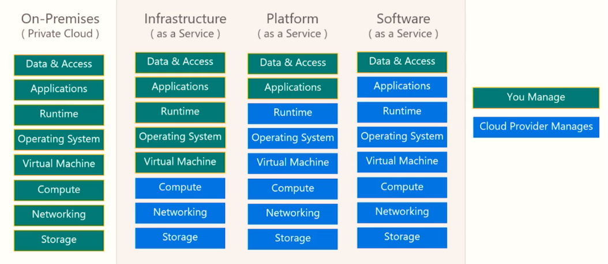

### Cloud Deployment Types:

- IaaS - Renting physical HW in the cloud. The cloud provider manages the underlying infrastructure and you manage OS patching, access, app, etc.

- PaaS - You only worry about your app. All the required underlying infrastructure gets deployed as you deploy your app. --- App service, Containers are PaaS.

- SaaS - Everything is managed by a cloud provider. You just use the app. E.g - Office365, Skype.

